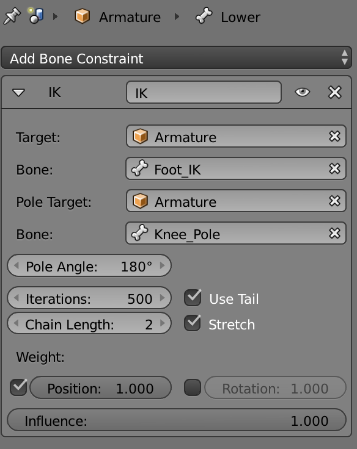

# Armature

The **armature** consists of a hierarchy of bones. Each bones have a head and a tail. A child bone's head is anchored at the tail of its parent.

### Posing
The process of setting the **angles** of each child compared to its parent. You do not set the size of bones - they are fixed size like in the real world.

### Disconnected bones
An amatature can have several hierarchies of bones. If that is the case, each hierarchy must be posed on its own.

### Rig
The armature can be used to control a mesh. The mesh is deformed by the armature. The precise way this is done is using a rigging algorithm.

## Inverse kinematics
Mostly as an animator you do not have the rotations as the goal, but the final position of say a foot or a hand, and have the computer compute the angles of the bones necessary to put the hand there.

Besides 3D animations, inverse kinematics are important in robotics to place arms and compute the movement (rotation of the joints) necessary to achieve the required position.

### Inverse kinematics in blender
There are many videos on how to set op a blender rig. I can [recommend this one](https://www.youtube.com/watch?v=cGvalWG8HBU) - you need to keep an eye open for which mode he is in though.

To be able to control a leg (or an arm), you need to be able to control the foot and the knee. 

In blender there is a constraint which take care of all aspects of inverse kinemation. 

It is one of the more complex constraints, so let me go through the setup of the inverse kinematics for a leg.

#### The IK heel bone
To position the foot we need an extra bone called the IK bone (inverse kinematics bone). The food bone is made a *child* of the IK bone *instead of* the lower leg.
The IK bone and its child (the foot) is disconnected from the leg.

The inverse kinematics constraint is placed on the **lower leg**. 

The way the foot becomes connected to the lower leg is because the foot_ik is set as target of the IK constraint.

#### Multiple solutions to the IK constraint
When you need to compute the bone rotations necessary to place the foot in one position, there can be many different knee locations. Try to it on a chair, put a foot on the floor - you can move the knee from side to side - each knee location being a solution to the inverse kinematic problem of the foot in the ground.

#### The knee pole
To able to specify how to move the knee, they add an extra detached bone. It is called a *pole bone*. It does not specify where the knee is, but in which direction the knee should move when you move the foot.

The knee bone is specified in the IK constraint as well.

#### Chain length
The final part of the IK is the chain length. It specify how far up the parent change the IK should be solved. Here it is 2, the lower and the upper leg.

